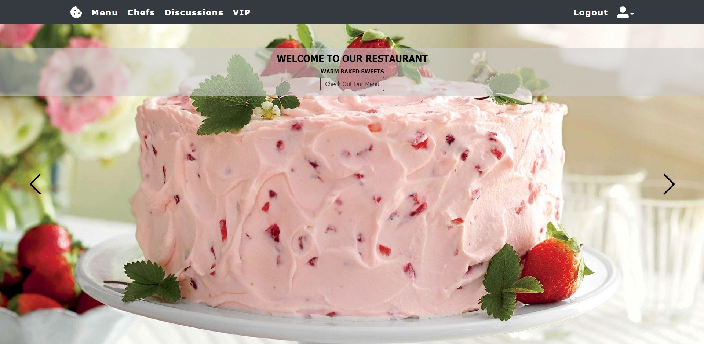

## Project Site
https://syedsadman16.github.io/Online-Restaurant-System-Frontend/#/
- Note that Heroku goes to sleep after 1 hour if it doesn't recieve any traffic. Once you're on the page, wait about 30 seconds for Heroku to wake up and reload. All features should be available and ready to go. (Check the instructions below to run locally) 

 

## Customer Demo 
 

#### Checkout the Screenshots folder for more images!

## Team R
- Syed Sadman
- Abir Deb
- Andrey Goryuk
- Michal Moryosef
- Samuel Fils
#### Project Specs 
https://docs.google.com/document/d/1lEruPP9p8F0GyLhqFYyd5d9nFlPnDlaE4Xk_Yul2MMw/edit?usp=sharing

## Project Structure

- /pages: page components
- /layout: Contains the 2 layout for app (Customer & Employees)
- /components: For Smaller components
- /redux: Files for global application state like user using Redux
- /utils : Utility files for js logic
- Routes.js: Declares all routes to map with a Layout & Page.
- auth.js: Authorization & authentication logic for routes.

## To run locally

### Run Backend
https://github.com/syedsadman16/Online-Restaurant-Backend
- Make sure that the backend is cloned and running 

### Clone repository

`git clone https://github.com/syedsadman16/Grannys-Sweets-Frontend.git`

### Move into project directory

`cd Grannys-Sweets-Frontend/`

### Install packages (creates node_modules folder)

`npm install`

### Startup localhost and run

`npm start`

## Technologies used for frontend
- React
- Redux
- React-Boostrap
- Material UI
- SCSS/SASS
